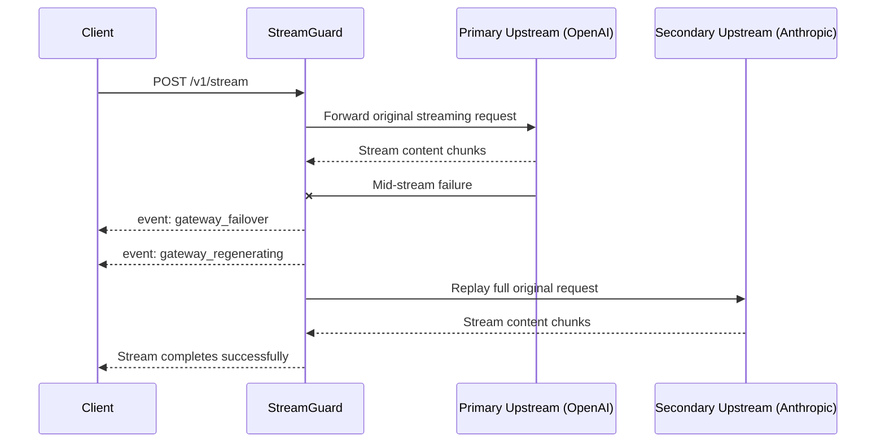

[](https://github.com/praveen-dhankhar/StreamGuard/actions/workflows/ci.yml)
[](https://goreportcard.com/report/github.com/praveen-dhankhar/StreamGuard)
[](https://go.dev/)
[](https://github.com/praveen-dhankhar/StreamGuard)

# StreamGuard

StreamGuard ensures your users never see a broken stream, and you never pay for a failed generation.

It is a Go reverse proxy for streaming LLM workloads that detects mid-stream upstream failures, fails over deterministically across configured providers, and exposes every recovery decision through an explicit SSE wire protocol.

- Preserves stream continuity across upstream `dead_socket`, `silent_hang`, and `malformed` failures.
- Emits a strict gateway event contract so clients can render failover and truncation states safely.
- Separates `tokens_delivered` from `tokens_billed` so failed attempts are visible without being billed.
- Enforces per-key budgets, allowlists, and admission-time rate limiting on the live path.
- Supports deterministic testing with a mock upstream harness, split-frame validation, and chaos-gated execution.



## Core Capabilities

- `POST /v1/stream` proxies SSE traffic and replays the original request body byte-for-byte during failover.
- `GET /usage/{key}` exposes authenticated, per-key usage totals aggregated across billing periods.
- `GET /healthz` returns operator-only liveness and circuit-breaker state; `GET /livez` returns unauthenticated liveness only.
- The reference client renders retained partial output, regeneration state, provider changes, and terminal truncation notices in a CLI surface.

## Prerequisites

- Go `1.22+`
- A configured `OPERATOR_TOKEN`
- A valid `keys.yaml` API key seed file
- Provider endpoints defined in `config.yaml`

## Installation / Running

Build and start the proxy:

```sh
go build ./...
OPERATOR_TOKEN=dev-operator-token go run ./cmd/streamguard
```

The server listens on `:8080` by default. Override the bind address explicitly when needed:

```sh
STREAMGUARD_ADDR=:9090 OPERATOR_TOKEN=dev-operator-token go run ./cmd/streamguard
```

The committed `config.yaml` points at `http://127.0.0.1:9001` and `http://127.0.0.1:9002`.

## Example Usage

Run the reference client against the local proxy:

```sh
go run ./client-ref --endpoint http://localhost:8080/v1/stream --api-key sg_live_demo "hello"
```

## HTTP API

### `POST /v1/stream`

Requires `Authorization: Bearer <api_key>`. The body must include `model` and `messages`. The request body is replayed unmodified during failover; there is no model-name translation.

Pre-stream errors use this JSON envelope:

```json
{"error":"<short_code>","message":"<human-readable detail>"}
```

Implemented codes:

| Status | Code |
|---|---|
| 400 | `invalid_request_body` |
| 401 | `invalid_api_key` |
| 403 | `provider_not_allowed` |
| 429 | `budget_exhausted` |
| 429 | `rate_limited` |

### `GET /usage/{key}`

Requires a matching client API key in the bearer token. Mismatch, missing auth, or invalid auth returns `403` with `unauthorized`.

### `GET /healthz`

Requires `Authorization: Bearer <operator_token>` from `OPERATOR_TOKEN`. Client API keys are rejected here.

### `GET /livez`

Unauthenticated liveness endpoint. It does not expose circuit-breaker detail.

## Wire Protocol

StreamGuard emits these gateway events interleaved with normal content chunks:

| Event | Notes |
|---|---|
| `gateway_status` | Emitted once at stream start, before content. |
| `gateway_failover` | Emitted when moving from one attempted provider to the next. Reasons are exactly `dead_socket`, `silent_hang`, or `malformed`. |
| `gateway_regenerating` | Emitted immediately after `gateway_failover`; tells the client to retain the partial block visibly. |
| `gateway_truncated` | Terminal event. Reasons are exactly `all_providers_exhausted` or `budget_exceeded`. |

The reference client in `client-ref/main.go` is a CLI. It uses ANSI faint text for retained partial output, color badges for state, and `--no-color` for plain terminal output.

## Billing Semantics

StreamGuard intentionally tracks separate counters:

| Counter | Scope |
|---|---|
| `tokens_delivered_before_failure` | One failed provider attempt only. |
| `gateway_truncated.tokens_delivered` | Cumulative tokens the client actually received across the whole request. |
| `tokens_billed` | Only the final non-superseded attempt's tokens. |

## Calibration

The current default config keeps these bootstrap values:

| Setting | Current value | Status |
|---|---:|---|
| `timeouts.silent_hang_deadline_ms` | `4500` | Bootstrap value; calibration logger records inter-token gaps. |
| `reconciliation.drift_threshold_pct` | `4.2` | Bootstrap value; reconciliation pushes drift samples. |

A production calibration pass must collect at least `1,000` `inter_token_gap` samples and `100` `drift` samples from mock-harness or production-like traffic before replacing these values.

## Architectural Notes

**Deterministic Failure Recovery:** StreamGuard fails over through a configured provider priority order and replays the full original request body on every new attempt.

**Strict Wire Contract:** Recovery is not hidden behind opaque retries. Clients receive explicit `gateway_status`, `gateway_failover`, `gateway_regenerating`, and `gateway_truncated` events.

**Split Billing and Delivery Accounting:** Tokens delivered to the client and tokens billed to the ledger are deliberately different during failover. Failed attempts remain visible to the client but are excluded from billing when superseded.

**Admission-only Rate Limiting:** Rate limiting gates admission only; it never terminates an already-open stream.

**Exclusive Half-open Probing:** Circuit-breaker half-open probes are claimed atomically under a write lock so exactly one concurrent request becomes the probe.

**Calibration-grade Mocking:** The mock upstream injects jitter and configurable usage drift so timeout and reconciliation calibration inputs remain non-degenerate.

**Cross-period Usage Aggregation:** `/usage/{key}` aggregates token billing, truncation counts, drift flags, and reconciliation timestamps across all billing periods for that key.

**CLI-first Reference Client:** The reference client is a Go CLI, not a browser UI.

**Byte-for-byte Request Replay:** Failover forwards the original `model` and request payload unchanged; there is no cross-provider model translation.

**Startup Validation:** Invalid provider names, duplicate priorities, invalid URLs, invalid breaker or rate settings, missing key files, empty allowlists, and negative budgets are rejected at startup.

**Uniform Error Envelope:** Pre-stream and auth failures return a consistent JSON error body.

## Out of Scope

- Shared circuit-breaker state across replicas.
- Persistent ledger or API-key storage.
- API-key hot reload.
- Dynamic cost or latency routing.
- Cross-provider model-name translation.
- Enterprise auth, SSO, RBAC, or multi-tenant admin.
- Browser dashboard, Electron app, or mobile UI.
- Automatic tokenizer drift remediation.

## Known Limitations

- State is in process only; restart loses breaker, ledger, and budget runtime state.
- Token counting uses the local chunk or word counter for the mock harness path. Real provider tokenizer packages are not vendored in this repo.
- Calibration values remain bootstrap values until a full sample-count calibration run replaces them.
- Reconciliation is implemented as an idempotent job primitive, not as a long-running scheduler loop.
- Graceful shutdown uses `http.Server.Shutdown`; forced-close partial ledger recording is not separately implemented.
- Mid-stream provider swaps are visible to the user by design.
- Rate limiting is admission-only.
- A failover across providers forwards the original `model` field unchanged.

## Development, Testing & Chaos

Default verification:

```sh
go test ./...
go test -race ./...
go build ./...
```

Billing and failover verification:

```sh
go test ./internal/server -run 'TestBillingWorkedExample|TestBudgetExceeded'
```

Deterministic failover demo:

```sh
go test -v ./internal/server -run TestBillingWorkedExampleFailoverThenSuccess
```

Chaos execution is gated by both a build tag and a runtime flag:

```sh
go test -tags chaos_enabled ./...
STREAMGUARD_CHAOS_ENABLED=true go test -tags chaos_enabled ./...
```

Default builds exclude the `chaos` package from the final binary.
