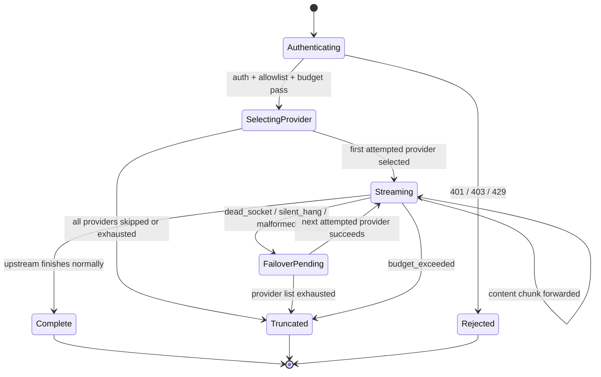
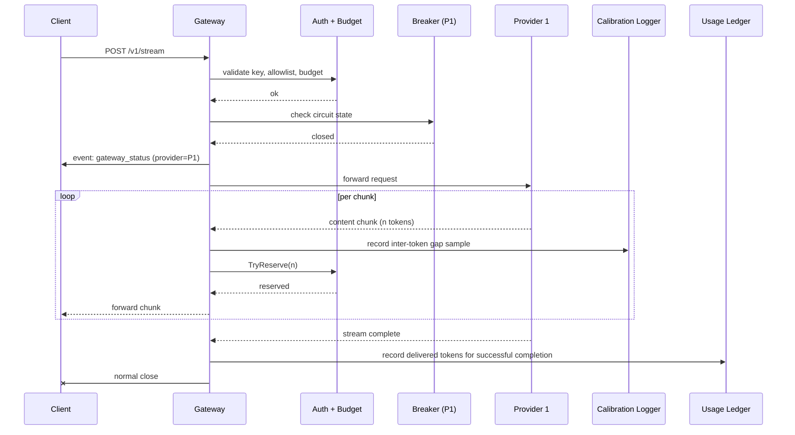
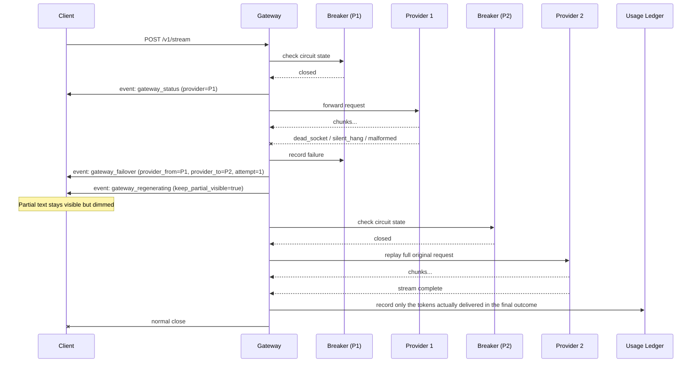
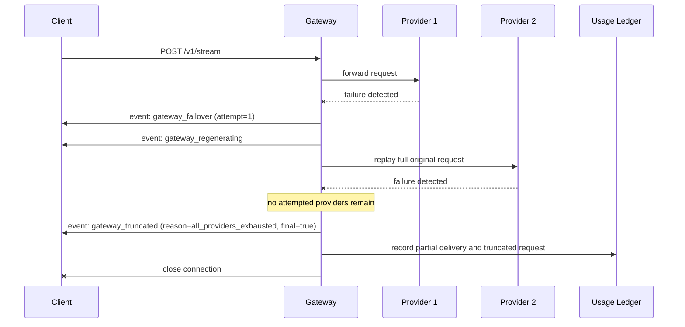
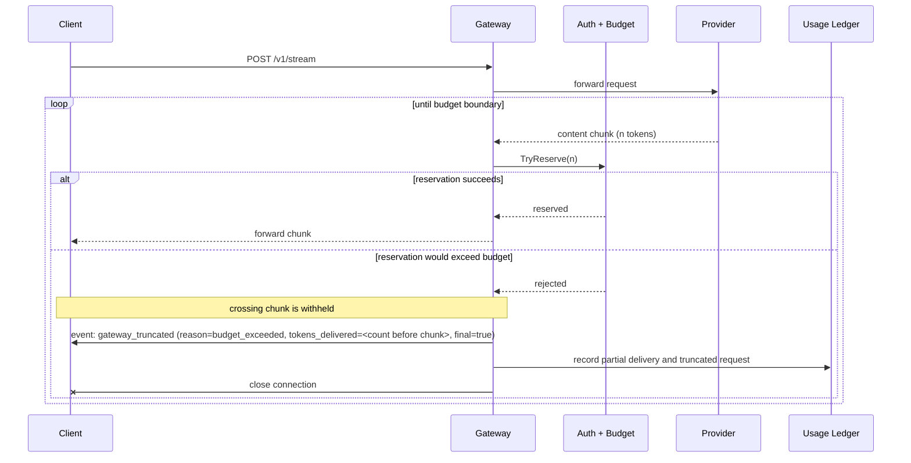
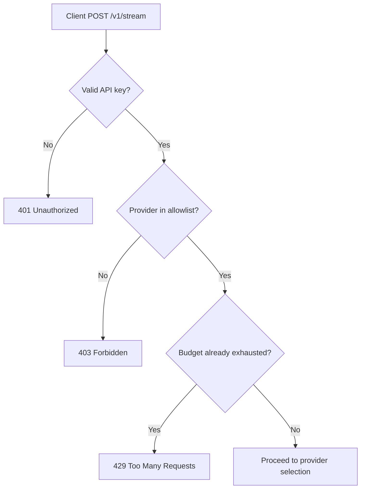
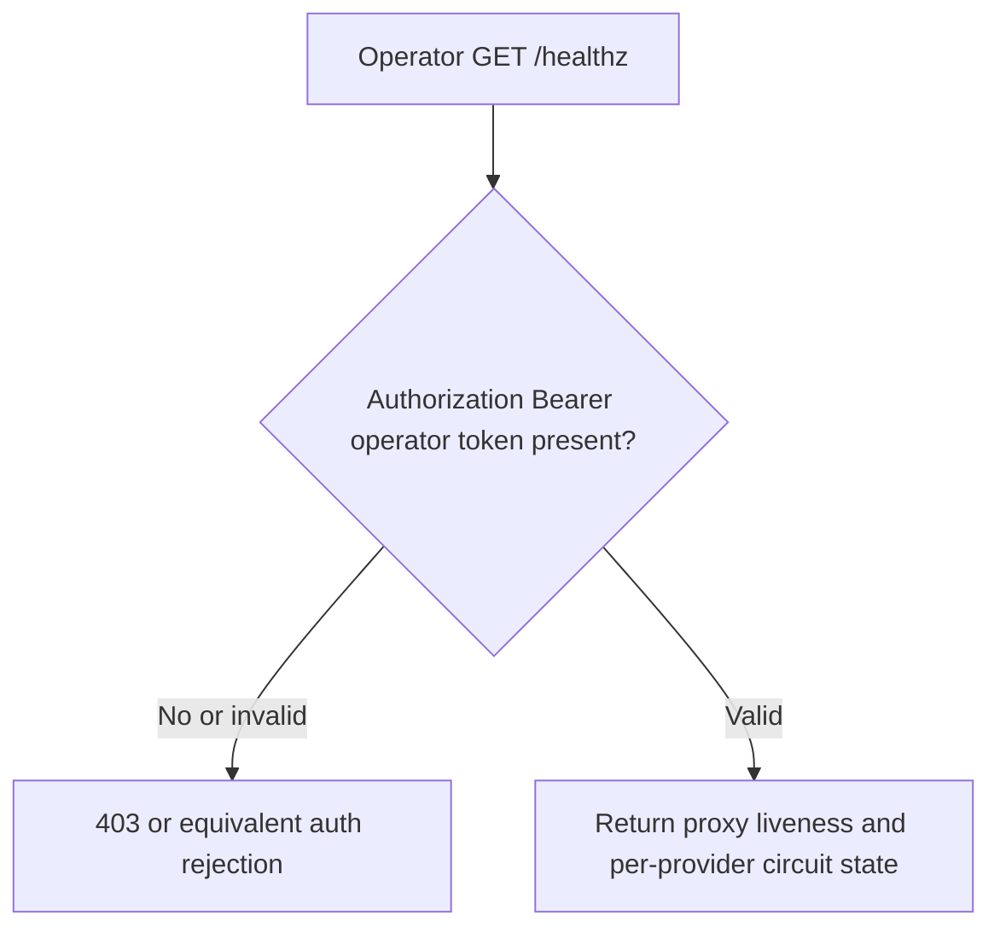
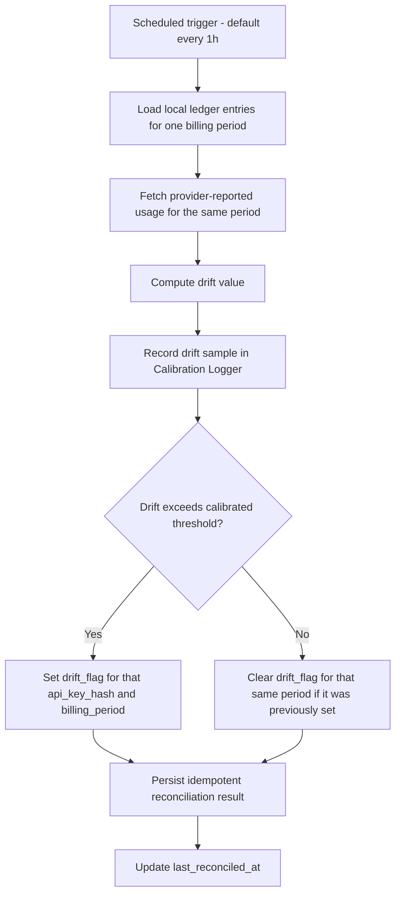
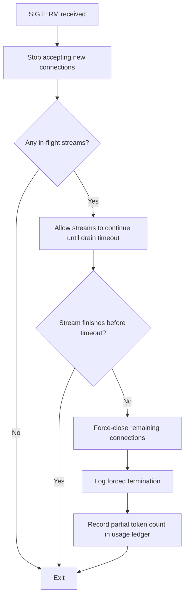

# StreamGuard — App Flow

**Companion to:** `streamguard-prd.md`, `streamguard-trd.md`
**Status:** Aligned to PRD v2.0 and TRD
**Last updated:** 19 June 2026

This document enumerates the concrete runtime paths StreamGuard is required to support. It follows the PRD and TRD exactly; it does not add new product behavior.

---

## 1. Request Lifecycle State Model



Client disconnect is handled as immediate request-context cancellation. It is a transport teardown, not a StreamGuard wire-protocol state: once the client is gone, there is no additional SSE event to emit.

---

## 2. Happy Path — Successful Stream on the First Attempted Provider

This is the baseline path: auth succeeds, the first attempted provider's circuit is not open, and the stream completes without failover or truncation.



Required behavior on this path:

- `gateway_status` is emitted once, before any content chunks.
- No `gateway_failover`, `gateway_regenerating`, or `gateway_truncated` events are emitted.
- Live token counting and budget reservation happen before each chunk is forwarded.
- The calibration logger records inter-token-gap samples from process start; successful traffic is part of the baseline used later for silent-hang calibration.

---

## 3. Open Circuit at Request Start

The cascade controller checks circuit state before every attempt, including the first. If the highest-priority provider is already `open`, StreamGuard skips it silently.

```mermaid
sequenceDiagram
    participant C as Client
    participant G as Gateway
    participant AB as Auth + Budget
    participant B1 as Breaker (P1)
    participant B2 as Breaker (P2)
    participant P2 as Provider 2

    C->>G: POST /v1/stream
    G->>AB: validate key, allowlist, budget
    AB-->>G: ok
    G->>B1: check circuit state
    B1-->>G: open
    Note over G,C: P1 is skipped silently; no gateway_failover
    G->>B2: check circuit state
    B2-->>G: closed
    G->>C: event: gateway_status (provider=P2)
    G->>P2: forward request
    P2-->>G: stream chunks...
    P2-->>G: stream complete
    G-xC: normal close
```

Required behavior on this path:

- A provider skipped because its circuit was already `open` is never surfaced as a `gateway_failover`.
- The client sees `gateway_status.provider` for the first provider actually attempted on this request.
- If every configured provider is already `open`, the list is exhausted without any upstream call and the terminal path is `gateway_truncated` with `reason: "all_providers_exhausted"`.

---

## 4. Mid-Stream Failover That Eventually Succeeds

The current provider begins streaming, then fails with one of the three defined failure modes. StreamGuard emits the failover events, replays the full original request against the next provider, and completes successfully.



Required behavior on this path:

- `gateway_status` is not re-emitted after failover. The client updates its provider display from `gateway_failover.provider_to`.
- `gateway_failover.reason` is one of `dead_socket`, `silent_hang`, or `malformed` only. `upstream_timeout` is not a valid protocol value.
- `gateway_regenerating` is emitted immediately after `gateway_failover`.
- The client retains the partial block, dims it, streams new content below it, and returns both blocks to full opacity together on successful completion.
- The replayed request is the full original request body, unmodified. No partial text from the failed attempt is appended into the retry prompt.
- Tokens from the failed attempt still count toward live budget/rate enforcement, but they do not count toward `tokens_billed` in the usage ledger.

---

## 5. Provider List Exhausted

This is the terminal failure path for the cascade controller. It is reached either because attempted providers fail one after another, or because every provider is skipped at request start due to an open circuit.



Required behavior on this path:

- `gateway_truncated.reason` is `all_providers_exhausted`.
- `gateway_truncated.final` is always `true`.
- After `gateway_truncated`, the proxy closes the stream and does not attempt further retries.
- The usage ledger records the partial token count that actually reached the client and increments `truncated_requests`.
- If exhaustion happened before any provider was attempted, `tokens_delivered` is `0` and no `gateway_failover` event is emitted.

---

## 6. Mid-Stream Budget Exhaustion

Budget exhaustion after the SSE stream is already open is handled through the wire protocol, not through an HTTP status code.



Required behavior on this path:

- The chunk that would push the key over budget is not forwarded to the client.
- The terminal event is `gateway_truncated` with `reason: "budget_exceeded"`.
- There is no HTTP `429` here because the stream is already open.
- The usage ledger records the token count at the moment the stream is cut off.

---

## 7. Pre-Stream Rejection

These checks happen before the SSE stream opens. Because no stream exists yet, StreamGuard returns plain HTTP responses rather than gateway events.



Required behavior on this path:

- Missing or invalid API key returns `401 Unauthorized`.
- Requested provider outside the key's allowlist returns `403 Forbidden`.
- A key whose budget is already exhausted before streaming begins returns `429 Too Many Requests`.
- No SSE stream is opened and no StreamGuard event is emitted.

---

## 8. Usage Ledger Read Flow — `GET /usage/{key}`

The usage endpoint is part of the product contract, not a debugging-only endpoint. Its auth rule is stricter than a typical "read any usage" admin surface: a key may read only its own data.

```mermaid
flowchart TD
    A[Client GET /usage/{key}] --> B{Authorization Bearer key present?}
    B -- No --> R1[403 Forbidden]
    B -- Yes --> C{Key valid?}
    C -- No --> R1
    C -- Yes --> D{Header key matches path key?}
    D -- No --> R1
    D -- Yes --> E[Return usage summary JSON]
```

On success, the response shape is:

```json
{
  "api_key": "sg_live_***",
  "tokens_billed": 184213,
  "truncated_requests": 3,
  "last_reconciled_at": "2026-06-19T03:00:00Z",
  "drift_flag": false
}
```

Required behavior on this path:

- Missing auth, invalid key, and key/path mismatch all return `403 Forbidden`.
- The endpoint returns usage data for the caller's key only.
- `tokens_billed` is based on delivered tokens only; failed-attempt tokens are excluded even though they counted toward live budget/rate enforcement.

---

## 9. Health Flow — `GET /healthz`

`GET /healthz` is an operator endpoint, not a client-key endpoint.



Required behavior on this path:

- Authentication uses `Authorization: Bearer <operator_token>`, sourced from `OPERATOR_TOKEN`.
- Client API keys are not valid credentials for this endpoint.
- The response includes proxy liveness plus per-provider circuit breaker state.
- An unauthenticated liveness surface, if exposed separately for infrastructure, must not include circuit breaker detail.

---

## 10. Reconciliation Batch Flow

Reconciliation is explicitly offline and idempotent per `(api_key_hash, billing_period)`. It never blocks the hot request path.



Required behavior on this path:

- The default schedule is hourly, but the interval is configurable.
- The threshold is derived from measured baseline drift, not guessed.
- A repeated reconciliation run for the same `(api_key_hash, billing_period)` does not double-count tokens or create duplicate flags.
- `drift_flag` can be set and later cleared for the same billing window if a later pass finds drift back within threshold.

---

## 11. Graceful Shutdown During Active Streams

On SIGTERM, StreamGuard stops accepting new work but lets in-flight streams drain up to `drain_timeout_s`.



Required behavior on this path:

- A stream sitting in failover state still counts as in-flight and remains inside the drain window.
- The drain timeout starts when SIGTERM is received, not when the request started.
- If the drain window expires while a failover stream is waiting on a new upstream provider, the proxy force-closes it, logs the forced termination, and records the partial token count in the ledger.

---

## 12. Summary Matrix

| Situation | Client-visible result | StreamGuard-specific events |
|---|---|---|
| First attempted provider succeeds | Normal streaming response | `gateway_status` once |
| Higher-priority provider open at request start | Stream starts on next attempted provider | `gateway_status` once; no `gateway_failover` for skipped provider |
| Mid-stream failover succeeds | Partial block dims, regenerated block streams below it, request completes | `gateway_status`, `gateway_failover`, `gateway_regenerating` |
| Attempted providers exhausted | Terminal incomplete response | `gateway_truncated` with `reason: "all_providers_exhausted"` |
| Budget exhausted mid-stream | Terminal incomplete response | `gateway_truncated` with `reason: "budget_exceeded"` |
| Auth or allowlist failure before stream | Plain HTTP rejection | None |
| `GET /usage/{key}` with missing/invalid/mismatched key | `403 Forbidden` | None |
| `GET /healthz` with invalid operator token | Auth rejection | None |
| Reconciliation run | No client-visible change unless usage is later read | None to the stream; ledger and drift state updated internally |
