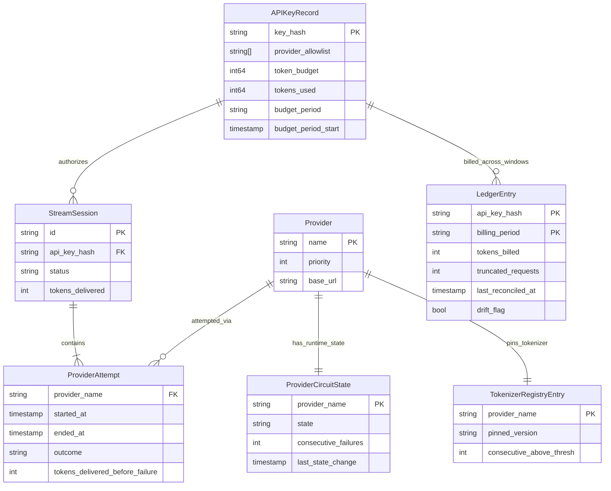

# StreamGuard — Backend Schema

**Companion to:** `streamguard-prd.md`, `streamguard-trd.md`, `streamguard-app-flow.md`
**Status:** Aligned to PRD v2.0 and TRD
**Last updated:** 19 June 2026

This document is the data-contract and runtime-model reference for StreamGuard. It covers the in-memory models, wire-protocol payloads, endpoint auth/response contracts, configuration shape, and store keying defined by the PRD and TRD.

---

## 1. Scope and Invariants

The schema surface is constrained by the source specs:

- v1 is single-instance and in-memory only. Ledger state, breaker state, and API-key store contents are not persisted across restarts.
- `gateway_failover.reason` is a closed enum: `dead_socket`, `silent_hang`, `malformed`. `upstream_timeout` is not valid anywhere in the system.
- `gateway_truncated.reason` is a closed enum with exactly two values: `all_providers_exhausted` and `budget_exceeded`.
- Tokens from a failed provider attempt count toward live budget/rate enforcement, but they do not count toward `LedgerEntry.TokensBilled`.
- Reconciliation is idempotent per `(api_key_hash, billing_period)`. That composite key is mandatory, not optional.
- `GET /usage/{key}` is authenticated and ownership-checked. A key may read only its own usage summary.

---

## 2. Runtime Model Overview



The Calibration Logger is intentionally not modeled as a business entity. It is an append-only sample stream for `inter_token_gap` and `drift` measurements used to derive the silent-hang deadline and drift threshold.

---

## 3. Data Dictionary

### 3.1 `Provider`

| Field | Type | Constraints | Notes |
|---|---|---|---|
| `Name` | string | not null | Provider identifier such as `openai` or `anthropic` |
| `Priority` | int | unique within config, lower is earlier | Determines cascade order |
| `BaseURL` | string | valid URL | Upstream base URL |
| `Tokenizer` | provider-specific interface | required at runtime | Must reflect the provider's actual tokenizer/billing behavior |

Owning component: provider config loaded at startup.

### 3.2 `CircuitBreakerConfig`

| Field | Type | Constraints | Notes |
|---|---|---|---|
| `FailureThreshold` | int | default `3` | Consecutive failures before moving `closed -> open` |
| `OpenTimeoutSeconds` | int | default `30` | Time spent in `open` before `half_open` probe is allowed |
| `HalfOpenSuccessThreshold` | int | default `1` | Successful probes required to move `half_open -> closed` |

These values live under the top-level `circuit_breaker` config key and may be overridden per provider.

### 3.3 `ProviderCircuitState`

| Field | Type | Constraints | Notes |
|---|---|---|---|
| `ProviderName` | string | FK -> `Provider.Name` | One state record per configured provider |
| `State` | enum | `closed`, `open`, `half_open` | Matches the PRD circuit-breaker state machine exactly |
| `ConsecutiveFailures` | int | `>= 0` | Resets on success |
| `LastStateChange` | timestamp | not null | Used to determine `open -> half_open` transition |

Owning component: per-provider circuit breaker, shared across request goroutines and protected by `sync.RWMutex`.

### 3.4 `APIKeyRecord`

| Field | Type | Constraints | Notes |
|---|---|---|---|
| `KeyHash` | string | PK, not null | Raw keys are never stored in memory or logs |
| `ProviderAllowlist` | `[]string` | not empty | Requested provider must be in this list or pre-stream auth fails with `403` |
| `TokenBudget` | int64 | `>= 0` | Budget for one `BudgetPeriod` |
| `TokensUsed` | int64 | `>= 0` | Live counter reserved through `TryReserve` only |
| `BudgetPeriod` | duration | required | Default comes from `budget.default_period` in config |
| `BudgetPeriodStart` | timestamp | required | Advanced by the Budget Resetter when the period rolls over |

Owning component: API Key Store loaded once at process startup from `auth.keys_file`.

Critical write-path rule: all token spending goes through `TryReserve(n)`. The system must never read `TokensUsed`, compare, and then increment in separate operations.

### 3.5 `StreamSession`

| Field | Type | Constraints | Notes |
|---|---|---|---|
| `ID` | string | unique per request | Tracks one client-facing stream across all provider attempts |
| `APIKeyHash` | string | FK -> `APIKeyRecord.KeyHash` | Owning caller identity |
| `ProviderAttempts` | `[]ProviderAttempt` | append-only for request lifetime | One entry per attempted provider |
| `TokensDelivered` | int | `>= 0` | Total tokens actually forwarded to the client |
| `Status` | enum-like string | `streaming`, `failover`, `truncated`, `complete` | Matches the TRD model |

Owning component: request-scoped gateway/cascade path. Held in memory only for the life of the request.

### 3.6 `ProviderAttempt`

| Field | Type | Constraints | Notes |
|---|---|---|---|
| `Provider` | string | FK -> `Provider.Name` | Attempted upstream provider |
| `StartedAt` | timestamp | not null | Attempt start time |
| `EndedAt` | timestamp | nullable until completion | Attempt end time |
| `Outcome` | enum | `success`, `dead_socket`, `silent_hang`, `malformed` | Same closed vocabulary used by failure detection and failover events |
| `TokensDeliveredBeforeFailure` | int | `>= 0` | Populated for failed attempts; `0` allowed |

Owning component: parser/failure detector plus cascade controller.

### 3.7 Gateway Event Payload Models

The SSE envelope is `event: <name>` plus `data: <json>`. The backend schema below is for the JSON `data` payload only.

| Event | Payload model | Required fields |
|---|---|---|
| `gateway_status` | `StatusData` | `state`, `provider` |
| `gateway_failover` | `FailoverData` | `reason`, `tokens_delivered_before_failure`, `provider_from`, `provider_to`, `attempt` |
| `gateway_regenerating` | `RegeneratingData` | `keep_partial_visible` |
| `gateway_truncated` | `TruncatedData` | `reason`, `tokens_delivered`, `final` |

Supporting closed enums:

| Enum | Allowed values |
|---|---|
| `FailoverReason` | `dead_socket`, `silent_hang`, `malformed` |
| `TruncatedReason` | `all_providers_exhausted`, `budget_exceeded` |

### 3.8 `LedgerEntry`

| Field | Type | Constraints | Notes |
|---|---|---|---|
| `APIKeyHash` | string | PK part 1 | Caller identity |
| `BillingPeriod` | string | PK part 2 | Canonical billing-window identifier |
| `TokensBilled` | int | `>= 0` | Delivered tokens only; excludes failed-attempt tokens |
| `TruncatedRequests` | int | `>= 0` | Incremented on terminal `gateway_truncated` outcomes |
| `LastReconciledAt` | timestamp | nullable until first reconciliation | Updated by reconciliation job |
| `DriftFlag` | bool | default `false` | Set when drift exceeds threshold; cleared by a later in-threshold pass for the same billing period |

Owning component: Usage Ledger behind a `sync.Mutex`.

Idempotency rule: reconciliation upserts by `(APIKeyHash, BillingPeriod)`. Re-running the same window updates the same record and must not double-count tokens or duplicate flags.

### 3.9 `UsageSummary` Projection for `GET /usage/{key}`

| Field | Type | Notes |
|---|---|---|
| `api_key` | string | Redacted display form returned to the caller |
| `tokens_billed` | int | Running delivered-token total for the caller |
| `truncated_requests` | int | Count of truncated outcomes for the caller |
| `last_reconciled_at` | timestamp or null | Timestamp of the most recent reconciliation affecting the caller; null until the first reconciliation run completes |
| `drift_flag` | bool | Current flag state for the relevant billing window returned by the endpoint |

This is a read model exposed to the caller. It is derived from ledger state; it is not a separate authoritative store.

### 3.10 `TokenizerRegistryEntry`

| Field | Type | Constraints | Notes |
|---|---|---|---|
| `ProviderName` | string | PK, FK -> `Provider.Name` | Provider being tracked |
| `PinnedVersion` | string | not null | Tokenizer library/version identifier currently pinned in the build |
| `ConsecutiveAboveThresh` | int | `>= 0` | Count of consecutive reconciliation windows above drift threshold |

Owning component: Tokenizer Registry. When this counter stays above threshold across several windows even after fresh calibration, the system logs `tokenizer_drift_suspected`.

---

## 4. Formal Wire-Protocol and Response Schemas

### 4.1 `gateway_status` payload

```json
{
  "$schema": "http://json-schema.org/draft-07/schema#",
  "title": "gateway_status_data",
  "type": "object",
  "additionalProperties": false,
  "required": ["state", "provider"],
  "properties": {
    "state": {
      "type": "string",
      "enum": ["healthy"]
    },
    "provider": {
      "type": "string",
      "minLength": 1
    }
  }
}
```

### 4.2 `gateway_failover` payload

```json
{
  "$schema": "http://json-schema.org/draft-07/schema#",
  "title": "gateway_failover_data",
  "type": "object",
  "additionalProperties": false,
  "required": [
    "reason",
    "tokens_delivered_before_failure",
    "provider_from",
    "provider_to",
    "attempt"
  ],
  "properties": {
    "reason": {
      "type": "string",
      "enum": ["dead_socket", "silent_hang", "malformed"]
    },
    "tokens_delivered_before_failure": {
      "type": "integer",
      "minimum": 0
    },
    "provider_from": {
      "type": "string",
      "minLength": 1
    },
    "provider_to": {
      "type": "string",
      "minLength": 1
    },
    "attempt": {
      "type": "integer",
      "minimum": 1
    }
  }
}
```

### 4.3 `gateway_regenerating` payload

```json
{
  "$schema": "http://json-schema.org/draft-07/schema#",
  "title": "gateway_regenerating_data",
  "type": "object",
  "additionalProperties": false,
  "required": ["keep_partial_visible"],
  "properties": {
    "keep_partial_visible": {
      "type": "boolean",
      "const": true
    }
  }
}
```

### 4.4 `gateway_truncated` payload

```json
{
  "$schema": "http://json-schema.org/draft-07/schema#",
  "title": "gateway_truncated_data",
  "type": "object",
  "additionalProperties": false,
  "required": ["reason", "tokens_delivered", "final"],
  "properties": {
    "reason": {
      "type": "string",
      "enum": ["all_providers_exhausted", "budget_exceeded"]
    },
    "tokens_delivered": {
      "type": "integer",
      "minimum": 0
    },
    "final": {
      "type": "boolean",
      "const": true
    }
  }
}
```

### 4.5 `GET /usage/{key}` success response

```json
{
  "$schema": "http://json-schema.org/draft-07/schema#",
  "title": "usage_summary_response",
  "type": "object",
  "additionalProperties": false,
  "required": [
    "api_key",
    "tokens_billed",
    "truncated_requests",
    "last_reconciled_at",
    "drift_flag"
  ],
  "properties": {
    "api_key": {
      "type": "string",
      "minLength": 1
    },
    "tokens_billed": {
      "type": "integer",
      "minimum": 0
    },
    "truncated_requests": {
      "type": "integer",
      "minimum": 0
    },
    "last_reconciled_at": {
      "anyOf": [
        {
          "type": "string",
          "format": "date-time"
        },
        {
          "type": "null"
        }
      ]
    },
    "drift_flag": {
      "type": "boolean"
    }
  }
}
```

`GET /healthz` is intentionally not given a stricter body schema here because the source documents define its auth and required content categories, but not an exact JSON envelope. The implementation must return proxy liveness and per-provider circuit state, and it must require operator authentication.

---

## 5. Endpoint Auth and Contract Notes

| Surface | Auth rule | Contract detail |
|---|---|---|
| `POST /v1/stream` | `Authorization: Bearer <api_key>` | Missing/invalid key -> `401`; provider not in allowlist -> `403`; budget already exhausted before stream start -> `429` |
| Mid-stream budget check | Same request context as the open stream | Crossing chunk is withheld, then `gateway_truncated` with `reason: "budget_exceeded"` closes the stream |
| `GET /usage/{key}` | `Authorization: Bearer <api_key>` and header key must equal path key | Missing auth, invalid key, or key/path mismatch -> `403 Forbidden` |
| `GET /healthz` | `Authorization: Bearer <operator_token>` from `OPERATOR_TOKEN` | Client API keys are not valid here; breaker-state detail must not be exposed without operator auth |

---

## 6. Configuration Schema

| Config path | Type | Required | Default / constraint | Notes |
|---|---|---|---|---|
| `circuit_breaker.failure_threshold` | int | yes | default `3` | Opens circuit after this many consecutive failures |
| `circuit_breaker.open_timeout_s` | int | yes | default `30` | Time in `open` before `half_open` probe |
| `circuit_breaker.half_open_success_threshold` | int | yes | default `1` | Successful probes needed to close circuit |
| `providers[].name` | string | yes | non-empty | Provider identifier |
| `providers[].priority` | int | yes | unique, `>= 0` | Lower priority value is attempted first |
| `providers[].base_url` | string | yes | valid URL | Upstream base URL |
| `providers[].circuit_breaker.*` | object | no | optional override | Per-provider override of top-level breaker defaults |
| `timeouts.silent_hang_deadline_ms` | int | yes | calibrated value | Must be derived from measured P99 inter-token gap, not guessed |
| `reconciliation.interval` | duration string | yes | default `1h` | Batch cadence |
| `reconciliation.drift_threshold_pct` | number | yes | calibrated value | Must be derived from measured baseline drift distribution |
| `rate_limit.window_s` | int | yes | default `60` | Sliding-window duration for live token enforcement |
| `budget.default_period` | duration string | yes | example `24h` | Default period assigned to newly provisioned keys |
| `auth.keys_file` | path string | yes | startup-loaded file | Read once at process startup; no hot-reload in v1 |
| `shutdown.drain_timeout_s` | int | yes | config-driven | Graceful shutdown drain window |

Secret values come from environment variables, not from committed config: `OPENAI_API_KEY`, `ANTHROPIC_API_KEY`, and `OPERATOR_TOKEN`.

---

## 7. In-Memory Store Key Design

| Store | Backing structure | Key | Notes |
|---|---|---|---|
| API Key Store | `map[string]*APIKeyRecord` | `key_hash` | Loaded once from `auth.keys_file` at startup |
| Circuit breaker states | `map[string]*ProviderCircuitState` | `provider_name` | Shared across requests, guarded by `sync.RWMutex` |
| Rate limiter | `sync.Map` or equivalent | `api_key_hash` | Sliding-window live counters |
| Usage ledger | `map[string]*LedgerEntry` or nested map | composite `(api_key_hash, billing_period)` | Composite key is required for reconciliation idempotency |
| Active sessions | `map[string]*StreamSession` | `session_id` | Request-lifetime only; removed when stream ends |
| Tokenizer registry | `map[string]*TokenizerRegistryEntry` | `provider_name` | Tracks pinned tokenizer version and consecutive above-threshold windows |
| Calibration samples | append-only buffer/stream | implementation-defined | Must at minimum retain sample kind, numeric value, and timestamp |

None of these stores are shared across replicas in v1.

---

## 8. Alignment Boundaries

To stay aligned to the PRD and TRD, this schema deliberately excludes or constrains the following:

- No persistence schema is part of the v1 contract. Persistent tables are an extension path, not a current requirement.
- No API-key hot-reload schema is defined. Keys are loaded once at startup.
- No cross-replica state-sharing schema is defined. Breaker state and ledger state remain in-process only.
- No additional gateway events or enum values are allowed beyond the four defined event types and their closed reason sets.
- No `protocol_version` field is introduced in v1 because the source specs do not require one.
