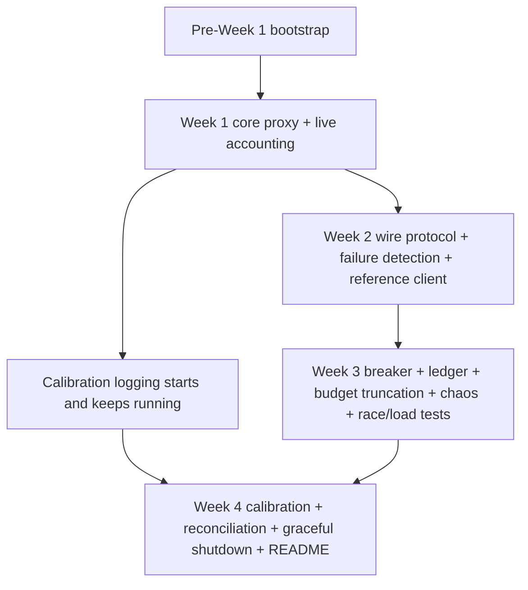

# StreamGuard — Implementation Workflow

**Companion to:** `streamguard-prd.md`, `streamguard-trd.md`, `streamguard-app-flow.md`, `streamguard-backend-schema.md`, `streamguard-ui-ux-brief.md`
**Status:** Aligned to PRD v2.0 and TRD
**Last updated:** 19 June 2026

This workflow is the build order for the v1 scope already defined in the PRD and TRD. It preserves the PRD milestone sequencing, especially the calibration constraint: measured values cannot be invented late in the project if logging did not start early.

---

## 1. Scheduling Constraint That Governs the Whole Plan

Two values are calibration outputs, not initial implementation guesses:

- `timeouts.silent_hang_deadline_ms`
- `reconciliation.drift_threshold_pct`

Per PRD §11, both depend on real data accumulated over time. That means instrumentation starts in Week 1, placeholder values are allowed in Week 2 only where explicitly called for, and Week 4 is when the real measurements replace those placeholders.

If logging does not begin early, Week 4 cannot be completed honestly.

---

## 2. Dependency Graph

UI work ends at the reference client. No separate dashboard track exists in this workflow because it is not part of the source scope.

---

## 3. Pre-Week 1 Bootstrap

### Work items

- Create the package layout from TRD §9:
  - `cmd/streamguard`
  - `internal/cascade`
  - `internal/breaker`
  - `internal/parser`
  - `internal/ratelimit`
  - `internal/budget`
  - `internal/ledger`
  - `internal/reconcile`
  - `internal/tokenizer`
  - `internal/calibration`
  - `internal/auth`
  - `internal/protocol`
  - `chaos`
  - `client-ref`
- Implement config loading for `config.yaml` plus environment overrides for `OPENAI_API_KEY`, `ANTHROPIC_API_KEY`, and `OPERATOR_TOKEN`.
- Wire startup loading for `auth.keys_file`.
- Add baseline CI commands: `go build ./...`, `go test ./...`, and `go test -race ./...`.
- Ensure the chaos harness is absent from the default build and only available behind its dedicated build tag.

### Exit criteria

- `go build ./...` succeeds.
- Invalid config is rejected at startup.
- Default builds do not compile the chaos harness.

---

## 4. Week 1 — Core Proxy Path and Data Collection Start

This week maps to the Week 1 milestone in PRD §11.

### Work items

- Build the base `POST /v1/stream` proxy path with SSE pass-through.
- Implement the cascade controller skeleton for FR-1:
  - single-provider exhaustion behavior
  - full-request replay semantics
  - silent skip when a provider is already `open` at request start
- Implement API-key auth, provider allowlist enforcement, and pre-stream rejection codes:
  - `401` for missing/invalid key
  - `403` for allowlist violation
  - `429` for budget already exhausted before stream start
- Integrate provider-specific token counting and `APIKeyRecord.TryReserve`.
- Implement the sliding-window live enforcement path with configurable `rate_limit.window_s` defaulting to 60 seconds.
- Start calibration data collection now:
  - record inter-token-gap samples from successful and failed streams
  - begin collecting the raw provider-usage inputs needed to compute drift by Week 4, even before threshold comparison exists
- Add redacted structured logging for request/response handling and protocol metadata.

### Exit criteria

- Happy-path streaming works end to end against a real provider.
- Open-circuit-at-request-start behavior is implemented and tested.
- Live token counting and budget reservation are active on the streaming path.
- Calibration logging is running from this point forward.

---

## 5. Week 2 — Wire Protocol, Failure Detection, Reference Client

This week maps to the Week 2 milestone in PRD §11.

### Work items

- Implement the four wire-protocol events from PRD FR-2:
  - `gateway_status`
  - `gateway_failover`
  - `gateway_regenerating`
  - `gateway_truncated`
- Enforce the closed reason enums and 1-indexed failover attempt numbering.
- Build the frame-reassembly parser:
  - buffer partial TCP reads
  - validate only after a full SSE frame is reassembled
  - classify malformed frames only after full-frame validation fails
- Add the required negative unit test proving a legitimately split frame does not trigger `malformed`.
- Implement the three failure detectors:
  - immediate dead-socket detection
  - silent-hang detection using a placeholder timeout marked for Week 4 replacement
  - malformed-frame detection on fully reassembled frames only
- Extend the cascade controller to multi-provider failover with full-request replay.
- Build the minimal reference client from the UI/UX brief:
  - dim retained partial output on `gateway_regenerating`
  - stream regenerated output in a new block below it
  - update provider display from `gateway_failover.provider_to`
  - do not expect a second `gateway_status`

### Exit criteria

- Single-failover success and full provider exhaustion both work end to end through the reference client.
- The split-frame negative test is present and passing.
- No invalid reason values appear in code, tests, or docs.
- The only placeholder left on this path is the explicitly temporary silent-hang timeout.

---

## 6. Week 3 — Circuit Breaker, Ledger, Budget Truncation, Chaos, Concurrency

This week maps to the Week 3 milestone in PRD §11.

### Work items

- Finish the circuit-breaker state machine from PRD §7:
  - `closed -> open`
  - `open -> half_open`
  - `half_open -> closed`
  - `half_open -> open`
- Support top-level breaker defaults plus optional per-provider overrides from config.
- Implement the usage ledger keyed by `(api_key_hash, billing_period)`.
- Implement authenticated `GET /usage/{key}` with strict ownership checking and `403` on mismatch.
- Implement mid-stream budget exhaustion:
  - reserve before forwarding each chunk
  - withhold the chunk that would cross the budget
  - emit `gateway_truncated` with `reason: "budget_exceeded"`
  - record the partial delivered-token count in the ledger
- Implement `GET /healthz` with operator-token auth from `OPERATOR_TOKEN`.
- Build the chaos harness with both required gates:
  - build tag exclusion from default builds
  - runtime activation only when `STREAMGUARD_CHAOS_ENABLED=true`
- Exercise all three failure modes through the chaos harness.
- Run concurrency proof work:
  - `go test -race` across shared-state packages
  - concurrent `TryReserve` stress tests near budget boundaries
  - 50+ concurrent stream load test with randomized injected failures

### Exit criteria

- NFR-1 and NFR-2 pass.
- Usage endpoint auth and ownership tests pass.
- Budget-exceeded truncation is covered by an integration test.
- Circuit-breaker transitions are exercised through the chaos harness, not only unit tests.
- A default build remains free of the chaos harness.

---

## 7. Week 4 — Calibration, Reconciliation, Graceful Shutdown, README, Final Verification

This week maps to the Week 4 milestone in PRD §11.

### Work items

- Pull the accumulated inter-token-gap data and compute the real P99 baseline.
- Replace the Week 2 placeholder timeout with the measured silent-hang deadline and document:
  - measured P99
  - chosen multiplier
  - resulting configured deadline
- Pull the accumulated drift data and compute the baseline distribution used for `drift_threshold_pct`.
- Implement the reconciliation job:
  - configurable interval, default `1h`
  - idempotent upsert keyed by `(api_key_hash, billing_period)`
  - set `drift_flag` when drift exceeds threshold
  - clear `drift_flag` when a later pass over the same window falls back within threshold
  - push drift samples to the calibration logger on every run
  - push above-threshold streak information into the tokenizer registry
- Implement tokenizer-drift suspicion logging when above-threshold windows persist after recalibration.
- Implement graceful shutdown:
  - stop accepting new requests on SIGTERM
  - keep in-flight streams, including failover-state streams, inside the drain window
  - force-close and ledger-record partial counts when the drain window expires
- Update the README with:
  - measured detection times
  - measured P99 inter-token gap and chosen multiplier
  - measured drift distribution and chosen threshold
  - load-test/race-test results
  - explicit out-of-scope section matching PRD §4
  - known limitations matching PRD §10
- Run the PRD §9 acceptance criteria top to bottom as the final release gate.

### Exit criteria

- No placeholder calibration values remain.
- Reconciliation behavior is verified for set, clear, and duplicate-run idempotency.
- Graceful shutdown is tested for both normal drain and forced close.
- The README reflects measured reality rather than assumed numbers.

---

## 8. Hard Gates

These are stop-work gates. Do not advance past them on hope.

| Gate | When checked | Required result |
|---|---|---|
| Split-frame negative test | End of Week 2 | Reassembled split frames do not produce false `malformed` detection |
| Chaos harness build isolation | End of bootstrap and again in Week 3 | Default build excludes chaos code |
| Race detector and concurrent load test | End of Week 3 | Zero races, zero panics, ledger totals match expected outcomes |
| Three weeks of calibration data | Start of Week 4 | Enough real data exists to compute P99 and baseline drift honestly |
| Acceptance checklist | End of Week 4 | Every PRD §9 item explicitly verified |

If a gate fails, fix the failed prerequisite first. Do not paper over it with manual testing or placeholder numbers.

---

## 9. Scope Guardrails

To keep this workflow aligned to the source scope:

- Do not add a separate dashboard workstream. The only required UI is the reference client.
- Do not add persistence, multi-instance shared state, dynamic routing, or enterprise auth.
- Do not treat reconciliation as real-time billing truth; it remains an offline batch job.
- Do not replace measured calibration values with assumptions just to keep the schedule.
