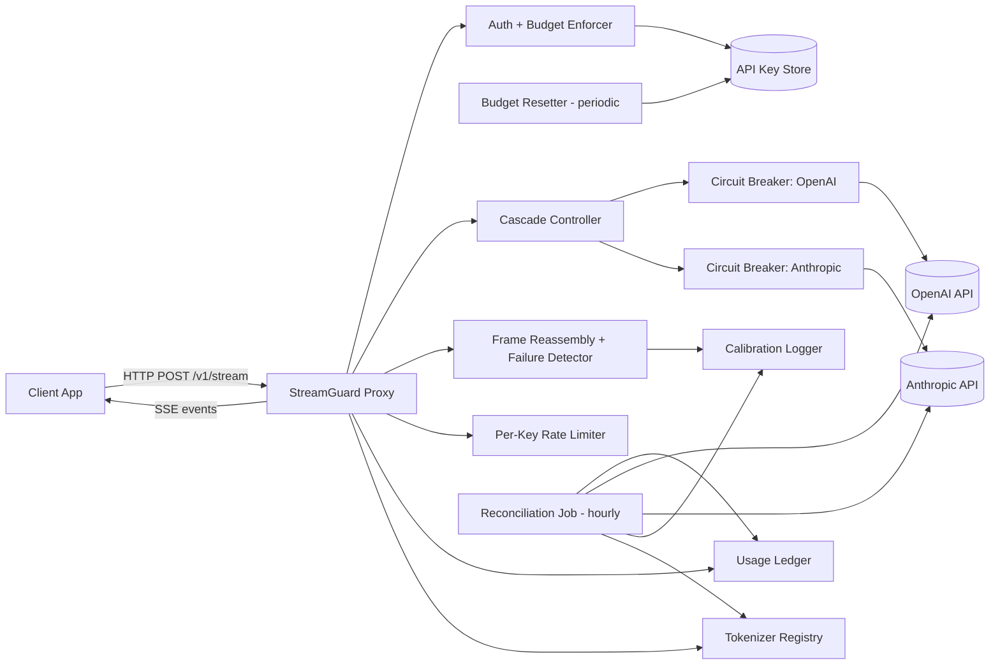
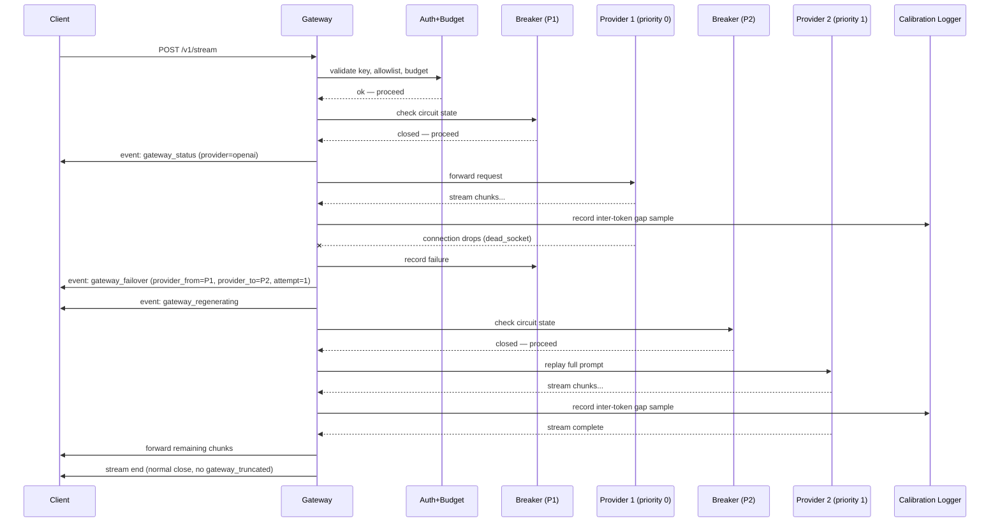
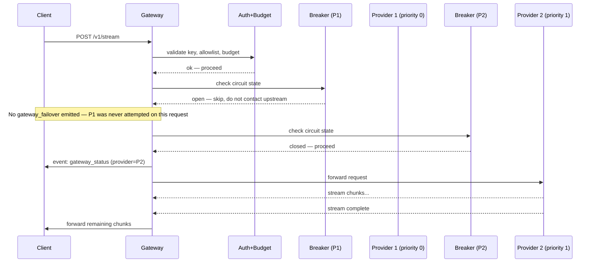
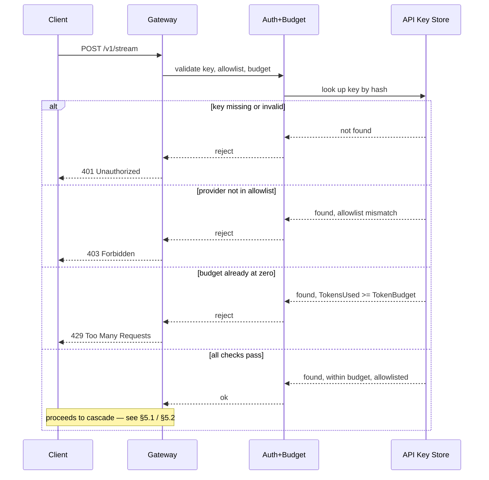
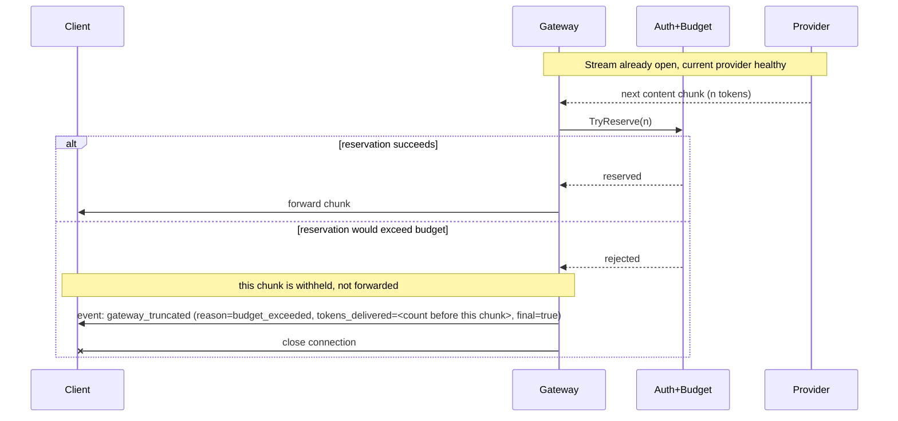

# StreamGuard — Technical Requirements Document (TRD)

**Companion to:** `streamguard-prd-v2.docx`
**Status:** Implementation-ready
**Author:** _[your name]_
**Last updated:** _[date]_

This document specifies *how* StreamGuard is built. The PRD defines what and why; this defines the architecture, data models, APIs, and concurrency design needed to implement it.

---

## 1. System Architecture



Samples flow **into** the Calibration Logger from whatever produced them — the parser pushes inter-token-gap samples as it observes them, and the reconciliation job pushes drift samples on every run. The Calibration Logger never originates data; it only accumulates it.

The cascade controller always consults the relevant circuit breaker before contacting a provider — this applies to the first attempt, not only to retries after a failure. A provider whose circuit is `open` at request start is skipped silently and is never surfaced to the client as a `gateway_failover` (see §5 and §7).

### Component responsibilities

| Component | Responsibility |
|---|---|
| Proxy / HTTP layer | Accepts client requests, manages SSE connection lifecycle |
| Auth + Budget Enforcer | Validates API key against the API Key Store, enforces provider allowlist and token budget at both pre-stream (HTTP) and mid-stream (wire protocol) checkpoints; redacts logs; enforces ownership on `/usage/{key}` |
| API Key Store | In-memory map of `APIKeyRecord` keyed by key hash, loaded once at process startup from a keys file (see §8, §9) |
| Budget Resetter | Background process that resets each key's `TokensUsed` to zero when its budget period elapses, independent of the request hot path |
| Cascade Controller | Implements the single failover algorithm (FR-1); owns provider priority order; checks circuit breaker state before every attempt, including the first |
| Circuit Breaker (per provider) | Tracks per-provider health (closed/open/half-open) per the state machine in §7; short-circuits known-bad providers without waiting for a fresh timeout |
| Frame Reassembly + Failure Detector | Buffers partial SSE frames, validates schema, classifies failures into the three defined modes; emits an inter-token-gap sample to the Calibration Logger on every received chunk |
| Rate Limiter | Sliding-window, per-API-key, fed by live token counts — including tokens from failed provider attempts (see §3) |
| Usage Ledger | In-memory store consuming billing-relevant events; backs `/usage/{key}`; excludes tokens from failed provider attempts from `TokensBilled` |
| Calibration Logger | Accumulates inter-token-gap samples (from the parser) and drift samples (from the reconciliation job) from process start. This is the data source the silent-hang deadline and drift threshold are derived from once enough samples exist |
| Tokenizer Registry | Tracks the pinned tokenizer library/version per provider; flags `tokenizer_drift_suspected` when a provider's measured drift stays above threshold across several consecutive reconciliation windows even after a fresh calibration — a distinct, operator-facing signal from the per-key `DriftFlag` |
| Reconciliation Job | Scheduled batch process comparing local counts to provider-reported usage; idempotent per `(api_key_hash, billing_period)`; pushes every computed drift value to the Calibration Logger and to the Tokenizer Registry |

---

## 2. Technology Stack

| Layer | Choice | Notes |
|---|---|---|
| Language | Go 1.22+ | Concurrency primitives (goroutines, channels, `context`) are core to the design, not incidental |
| HTTP | `net/http` + `http.Flusher` for SSE | No framework dependency needed for this scope |
| Tokenization | Provider-specific tokenizer libraries (e.g. `tiktoken-go` for OpenAI; Anthropic's published tokenizer/count-tokens endpoint as fallback) | Must match what each provider actually bills on; pinned version tracked by the Tokenizer Registry |
| Concurrency primitives | `sync.Mutex` / `sync/atomic` (including CAS loops where check-and-update must be a single atomic step — see §6) for hot-path counters; `context.Context` for cancellation propagation | Avoid channels where a mutex or CAS is simpler and sufficient |
| Testing | standard `testing` package, `-race` flag, `httptest` for HTTP mocking | |
| Config | Environment variables + a single YAML config file for provider list/priority/circuit breaker/rate-limit/budget defaults | |
| Storage | In-memory for the ledger, breaker state, and the API key store | Explicitly not persisted; restart loses ledger state and any runtime key/budget changes — documented limitation, see §12 |

---

## 3. Data Models

```go
// Provider represents one configured upstream LLM provider.
type Provider struct {
    Name      string // "openai", "anthropic"
    Priority  int    // lower = tried first
    BaseURL   string
    Tokenizer TokenCounter
}

// CircuitBreakerState is per-provider, in-process.
type CircuitBreakerState int
const (
    Closed CircuitBreakerState = iota
    Open
    HalfOpen
)

// CircuitBreakerConfig is loaded from config.yaml's top-level circuit_breaker
// key as the default, with an optional per-provider override under that
// provider's own circuit_breaker key (see §8). All three fields must be
// configurable; these are the documented defaults.
type CircuitBreakerConfig struct {
    FailureThreshold         int // default 3  — consecutive failures before opening
    OpenTimeoutSeconds       int // default 30 — seconds open before half_open probe
    HalfOpenSuccessThreshold int // default 1  — successful probes required to close
}

// APIKeyRecord holds per-key auth, allowlist, and budget state.
// The raw key is never stored; only its hash, to minimize log-redaction
// surface and leak risk.
type APIKeyRecord struct {
    KeyHash          string
    ProviderAllowlist []string
    TokenBudget       int64     // total tokens permitted within one BudgetPeriod
    TokensUsed        int64     // live counter; reset to 0 by the Budget Resetter at each period boundary
    BudgetPeriod      time.Duration // e.g. 24h; default comes from config.yaml's budget.default_period
    BudgetPeriodStart time.Time     // when the current period began; advanced by the Budget Resetter
}

// TryReserve attempts to atomically claim n tokens against the key's budget.
// It is the only sanctioned way to spend budget — never read TokensUsed and
// TokenBudget separately and increment afterward, since that is a
// check-then-act race (see §6).
func (k *APIKeyRecord) TryReserve(n int64) bool {
    for {
        used := atomic.LoadInt64(&k.TokensUsed)
        if used+n > k.TokenBudget {
            return false
        }
        if atomic.CompareAndSwapInt64(&k.TokensUsed, used, used+n) {
            return true
        }
        // Another goroutine updated TokensUsed concurrently — reload and retry.
    }
}

// StreamSession tracks one client-facing request across however many
// upstream attempts the cascade makes.
type StreamSession struct {
    ID               string
    APIKeyHash       string
    ProviderAttempts []ProviderAttempt
    TokensDelivered  int
    Status           string // "streaming" | "failover" | "truncated" | "complete"
}

type ProviderAttempt struct {
    Provider                     string
    StartedAt                    time.Time
    EndedAt                      time.Time
    Outcome                      string // "success" | "dead_socket" | "silent_hang" | "malformed"
    TokensDeliveredBeforeFailure int
}

// GatewayEvent is the wire-format event sent to the client.
// Field names intentionally avoid claiming knowledge the proxy doesn't have
// (e.g. no "tokens_lost" field — the proxy never knows how many tokens
// would have been generated, only how many were delivered).
type GatewayEvent struct {
    Event string      `json:"-"` // SSE event name
    Data  interface{} `json:"data"`
}

// Every event type below has an explicit struct. Event payloads are part
// of the contract with the reference client (FR-3) and should not be
// represented as a bare map[string]interface{}.

type StatusData struct {
    State    string `json:"state"`    // e.g. "healthy"
    Provider string `json:"provider"` // provider serving this request
}

// FailoverReason is a closed enum. "upstream_timeout" is not a valid
// value and must never appear in code, tests, or logs — validate against
// this list rather than accepting an arbitrary string.
type FailoverReason string
const (
    ReasonDeadSocket FailoverReason = "dead_socket"
    ReasonSilentHang FailoverReason = "silent_hang"
    ReasonMalformed  FailoverReason = "malformed"
)

type FailoverData struct {
    Reason                       FailoverReason `json:"reason"`
    TokensDeliveredBeforeFailure int            `json:"tokens_delivered_before_failure"`
    ProviderFrom                 string         `json:"provider_from"`
    ProviderTo                   string         `json:"provider_to"`
    Attempt                      int            `json:"attempt"` // 1-indexed
}

type RegeneratingData struct {
    KeepPartialVisible bool `json:"keep_partial_visible"`
}

// TruncatedReason is a closed enum with exactly two members.
type TruncatedReason string
const (
    ReasonAllProvidersExhausted TruncatedReason = "all_providers_exhausted"
    ReasonBudgetExceeded        TruncatedReason = "budget_exceeded"
)

type TruncatedData struct {
    Reason          TruncatedReason `json:"reason"`
    TokensDelivered int             `json:"tokens_delivered"`
    Final           bool            `json:"final"`
}

// LedgerEntry is what the usage ledger accumulates per API key per billing window.
// Keyed by (APIKeyHash, BillingPeriod) — this composite key is what makes
// reconciliation idempotent.
type LedgerEntry struct {
    APIKeyHash        string
    BillingPeriod     string // canonical window identifier, e.g. "2026-06-19T03:00:00Z/1h"
    TokensBilled      int    // tokens actually delivered to the client —
                              // excludes any tokens from a failed provider attempt
    TruncatedRequests int
    LastReconciledAt  time.Time
    DriftFlag         bool   // set when drift exceeds threshold for this BillingPeriod;
                              // cleared by a later pass over the SAME period that finds
                              // drift within threshold — see §6 and §10
}

// TokenizerRegistry tracks which tokenizer version is pinned per provider
// and surfaces suspected drift caused by an upstream tokenizer change.
type TokenizerRegistry struct {
    PinnedVersion          map[string]string // provider name -> tokenizer library/version identifier
    ConsecutiveAboveThresh map[string]int    // provider name -> count of consecutive reconciliation windows above threshold
}
```

**Token-accounting note:** `RateLimiter` increments on every token delivered, including tokens from an attempt that later fails over — this is the anti-gaming requirement: a client cannot reset its effective rate limit by repeatedly triggering failovers. `LedgerEntry.TokensBilled`, in contrast, only increments from tokens that made it to the client in a request's final outcome (success or truncation). These two counters are expected to diverge whenever a failover occurred, and that divergence is correct behavior, not a bug to reconcile away.

**Budget-reservation note:** the chunk of tokens that would push a key over its budget is never forwarded to the client. The proxy calls `TryReserve` *before* forwarding each chunk; if the reservation fails, that chunk is withheld and the stream terminates via `gateway_truncated` with `tokens_delivered` reflecting only what was already sent. See §5.4.

---

## 4. API Specification

### 4.1 `POST /v1/stream` — client-facing streaming endpoint

**Request**
```json
{
  "model": "gpt-4o",
  "messages": [{"role": "user", "content": "..."}],
  "stream": true
}
```
Headers: `Authorization: Bearer <api_key>`

**Pre-stream rejection — plain HTTP responses, stream never opens:**

| Condition | Status |
|---|---|
| Missing or invalid API key | `401 Unauthorized` |
| Requested provider not in the key's allowlist | `403 Forbidden` |
| Key's token budget already at zero | `429 Too Many Requests` |

See §5.3 for the full pre-stream rejection sequence.

**Mid-stream budget exhaustion:** if a reservation for an upcoming chunk fails because it would exceed the budget, the proxy does not return an HTTP status — the stream is already established. It emits `gateway_truncated` with `reason: "budget_exceeded"`, withholds the chunk that would have crossed the budget, and closes the connection. See §5.4.

**Response:** `text/event-stream`. Content chunks pass through from the upstream provider largely unchanged; the events below are StreamGuard-specific and interleaved with them.

| Event | When emitted | Re-emitted after failover? |
|---|---|---|
| `gateway_status` | Once, at stream start, naming the provider being used | No — after a failover, the client reads the new provider from `gateway_failover.provider_to` |
| `gateway_failover` | Each time the cascade controller moves to the next *attempted* provider. Not emitted for a provider skipped silently because its circuit was already open at request start | — |
| `gateway_regenerating` | Immediately after `gateway_failover`, signaling the client to retain (not clear) the partial buffer | — |
| `gateway_truncated` | Terminal event when the provider list is exhausted (`all_providers_exhausted`) or when the key's token budget is exhausted mid-stream (`budget_exceeded`); `final: true` in both cases | — |

Full schema: see PRD §6 FR-2.

### 4.2 `GET /usage/{key}` — ledger read endpoint

**Auth (required, not optional):** requires `Authorization: Bearer <api_key>`. The key in the header must match the `{key}` path parameter. Any of: missing header, invalid key, or a key attempting to read another key's data → `403 Forbidden`. This endpoint exposes per-key billing data; an unauthenticated version of it would be a data leak by design, so the ownership check is a hard requirement.

**Response (200, on successful ownership check)**
```json
{
  "api_key": "sg_live_***",
  "tokens_billed": 184213,
  "truncated_requests": 3,
  "last_reconciled_at": "2026-06-19T03:00:00Z",
  "drift_flag": false
}
```

### 4.3 `GET /healthz`

Returns proxy liveness and per-provider circuit breaker state. Used by graceful shutdown and by operators.

**Auth:** requires `Authorization: Bearer <operator_token>`, a credential distinct from client API keys, sourced from the `OPERATOR_TOKEN` environment variable. This is deliberately separate from the no-auth-required liveness ping a load balancer might want: circuit breaker state reveals which upstream provider is currently degraded, which is operationally sensitive even though it carries no per-key billing data. A plain unauthenticated liveness check (process-up/down only, no breaker detail) may be exposed separately if a load balancer needs one; that endpoint must not include breaker state.

---

## 5. Cascade Algorithm — Detailed Sequence

### 5.1 Normal failover path (circuit closed on both providers)



If P2 also fails, the controller checks the provider list: if exhausted, emit `gateway_truncated` with `final: true` and `reason: "all_providers_exhausted"` instead of attempting another provider.

### 5.2 Open-circuit-at-request-start path



If every configured provider has an open circuit at request start, the cascade exhausts the list without making a single upstream call and emits `gateway_truncated` with `reason: "all_providers_exhausted"`.

### 5.3 Pre-stream rejection path



### 5.4 Mid-stream budget exhaustion



---

## 6. Concurrency Design

- **Per-request goroutine:** each client stream is handled in its own goroutine, with a `context.Context` derived from the incoming HTTP request, canceled on client disconnect.
- **Per-provider circuit breaker state:** shared across all goroutines for a given provider; protected by `sync.RWMutex` (read-heavy: every request checks state, writes only on state transitions).
- **Rate limiter:** per-API-key sliding window counters, `sync.Map` keyed by API key hash, with atomic increment/decrement for the live token count. Increments fire on every token delivered, including tokens from an attempt that later fails over (see §3).
- **Budget enforcer:** all spending against a key's budget goes through `APIKeyRecord.TryReserve` (§3), a compare-and-swap loop that performs the threshold check and the increment as a single atomic step. This is deliberate: reading `TokensUsed`, comparing it to `TokenBudget`, and incrementing afterward as three separate operations is a check-then-act race — two concurrent chunks could each observe "budget not yet exceeded" and both proceed, overspending the budget. `TryReserve` closes that race by retrying against the freshly observed value on CAS failure rather than ever writing a stale decision.
- **Budget resetter:** a background goroutine, independent of the request hot path, scans `APIKeyRecord`s on a ticker and resets `TokensUsed` to zero (advancing `BudgetPeriodStart`) once `now >= BudgetPeriodStart + BudgetPeriod`. It never touches the hot-path reservation logic directly — it only resets the counter `TryReserve` reads.
- **Usage ledger:** single struct behind a `sync.Mutex`. Given expected write frequency — one write per completed or truncated stream, plus one per reconciliation pass — a single mutex is sufficient; no sharding is needed at this scope.
- **Reconciliation idempotency:** the reconciliation job upserts a `LedgerEntry` keyed by `(APIKeyHash, BillingPeriod)` under the ledger's mutex. A re-run for an already-processed period either (a) leaves an already-correct `DriftFlag` untouched with no double-counting of `TokensBilled`, or (b) clears `DriftFlag` if a fresh comparison for that same period now falls within threshold. The job never appends a second entry for a period it has already reconciled.
- **Two distinct uses of drift data:** every reconciliation run computes a drift value and unconditionally pushes it to the Calibration Logger as a raw sample — this is what eventually produces the P95 baseline that sets `drift_threshold_pct`. Independently, once a threshold is configured, that same run also compares its drift value against the threshold to decide whether to set or clear `DriftFlag` on the relevant `LedgerEntry`. Both happen on every run; the first is unconditional data collection, the second only has a real threshold to compare against once calibration has produced one.
- **Tokenizer drift escalation:** if a provider's drift remains above threshold for several consecutive reconciliation windows — tracked via `TokenizerRegistry.ConsecutiveAboveThresh` — even immediately after a fresh recalibration, the registry logs `tokenizer_drift_suspected` for that provider. This is a distinct, provider-scoped operator alert, separate from the per-key `DriftFlag`, and is not auto-remediated; the documented resolution is updating the tokenizer library, not a protocol change.
- **Calibration logger:** an append-only sample stream behind its own lightweight mutex or buffered channel, exposing a single `Sample(kind string, value float64)` call used by both the parser (inter-token gaps) and the reconciliation job (drift values). It is deliberately decoupled from the ledger and breaker locks so calibration logging can never become a contention point on the request hot path.
- **Required correctness proof:** `go test -race` across the breaker, rate limiter, ledger, and budget-enforcer packages, plus a load test harness firing 50+ concurrent simulated streams with randomized failure injection, asserting the ledger's final state matches the sum of individually tracked expected outcomes. The budget-enforcer race test specifically hammers `TryReserve` concurrently near a key's budget boundary and asserts that the number of successful reservations times tokens-per-reservation never exceeds `TokenBudget`.

---

## 7. Circuit Breaker Specification

| State | Definition | Transitions |
|---|---|---|
| `closed` | Normal operation. Requests pass through. | → `open` when `consecutive_failures` reaches `failure_threshold` (default 3) |
| `open` | Provider is known-bad. Requests are skipped without contacting the upstream. | → `half_open` after `open_timeout_s` elapses since last state change (default 30s) |
| `half_open` | One probe request allowed through to test recovery. | → `closed` if probe succeeds (default 1 success required) → `open` if probe fails |

**Cascade controller interaction — applies to every attempt, including the first:**

- `open`: skip the provider immediately, do not contact the upstream, do not emit `gateway_failover` — this provider was never attempted on this request.
- `half_open`: allow one probe attempt. Success → circuit closes, stream continues normally. Failure → cascade moves to the next provider, circuit returns to `open`.
- `closed`: proceed normally.

All three parameters (`failure_threshold`, `open_timeout_s`, `half_open_success_threshold`) are configurable via `config.yaml` under a top-level `circuit_breaker` key, which applies to every provider by default. Any provider may override one or more of these parameters under its own entry — see §8. This is a deliberate choice: most providers behave similarly enough to share defaults, but a flakier or newer provider integration can be tuned independently without touching the others.

---

## 8. Configuration

```yaml
# config.yaml
circuit_breaker:               # default, applies to every provider unless overridden below
  failure_threshold: 3
  open_timeout_s: 30
  half_open_success_threshold: 1

providers:
  - name: openai
    priority: 0
    base_url: https://api.openai.com
  - name: anthropic
    priority: 1
    base_url: https://api.anthropic.com
    circuit_breaker:            # optional per-provider override of the defaults above
      failure_threshold: 5

timeouts:
  silent_hang_deadline_ms: 4500   # set from measured P99 inter-token gap x 5 — see calibration notes in README

reconciliation:
  interval: 1h
  drift_threshold_pct: 4.2        # set from measured P95 baseline drift — see README

rate_limit:
  window_s: 60                    # sliding window duration; default shown

budget:
  default_period: 24h             # default BudgetPeriod for newly provisioned keys; can be overridden per key in the keys file

auth:
  keys_file: ./keys.yaml           # loaded once at process startup — see §9; hot-reload is out of scope, see §12

shutdown:
  drain_timeout_s: 30
```

Environment variables override file config for secrets (`OPENAI_API_KEY`, `ANTHROPIC_API_KEY`, `OPERATOR_TOKEN`) — never committed to the config file.

---

## 9. Package / Directory Structure

```
streamguard/
├── cmd/
│   └── streamguard/   # main.go, wiring, config load
├── internal/
│   ├── cascade/         # cascade controller, provider priority logic, breaker pre-check on every attempt
│   ├── breaker/           # per-provider circuit breaker, config-driven thresholds, per-provider overrides
│   ├── parser/             # frame reassembly + failure classification; calls calibration.Sample("inter_token_gap", ...) per chunk
│   ├── ratelimit/           # sliding window limiter
│   ├── budget/                # APIKeyRecord, API Key Store, TryReserve, Budget Resetter, pre-stream + mid-stream enforcement
│   ├── ledger/                  # usage ledger + /usage handler + ownership check
│   ├── reconcile/                 # batch reconciliation job, idempotent on (api_key_hash, billing_period); calls calibration.Sample("drift", ...) per run
│   ├── tokenizer/                   # Tokenizer Registry — pinned versions, consecutive-drift tracking, tokenizer_drift_suspected alerts
│   ├── calibration/                   # exposes Sample(kind string, value float64); accumulates samples pushed by parser and reconcile
│   ├── auth/                            # API key validation, operator token check, log redaction
│   └── protocol/                         # GatewayEvent types, SSE encoding
├── chaos/
│   └── harness.go   # //go:build chaos_enabled — excluded from the default build;
│                     # also requires STREAMGUARD_CHAOS_ENABLED=true at runtime,
│                     # a second, independent gate
├── client-ref/
│   └── main.go       # minimal reference client (FR-3)
├── keys.yaml          # example API key store seed file — see §12 for the hot-reload limitation
└── README.md
```

**Build-gating note:** `chaos/harness.go` carries a `//go:build chaos_enabled` constraint, so a default `go build` does not compile it at all. A test or load-test binary that needs it is built with `-tags chaos_enabled`. Even then, the harness checks `STREAMGUARD_CHAOS_ENABLED=true` at runtime before activating any fault injection, so an accidentally tagged build still can't silently inject faults in a production-like environment. A CI check builds the default target and asserts the `chaos` package is absent from the binary's symbol table.

---

## 10. Testing Strategy

| Layer | Method |
|---|---|
| Frame reassembly | Unit tests with deliberately split JSON across multiple reads — must NOT trigger false-positive `malformed` classification |
| Failure detection | Chaos harness drives all 3 modes against a mock upstream; detection time recorded per mode |
| Cascade algorithm | Table-driven tests: N providers, failure injected at varying points, assert correct terminal event; explicit case for "circuit open at request start → silent skip, no gateway_failover" |
| Circuit breaker | All transition paths exercised: `closed→open→half_open→closed` and `closed→open→half_open→open`; a per-provider override test confirms it does not affect siblings using the default |
| Auth & budget | Table-driven tests for the three pre-stream rejection codes (401/403/429, §5.3); integration test asserting mid-stream budget exhaustion emits `gateway_truncated`/`budget_exceeded` and withholds the crossing chunk (§5.4) |
| Budget concurrency | Concurrent `TryReserve` calls hammering a key near its budget boundary under `-race`; assert total successful reservations never exceed `TokenBudget` |
| Budget resetter | Assert `TokensUsed` resets to zero and `BudgetPeriodStart` advances once a period elapses, without affecting an in-flight reservation |
| Usage endpoint auth | Test asserting `403` on missing, invalid, or mismatched key against `GET /usage/{key}` |
| Healthz auth | Test asserting `GET /healthz` requires a valid operator token and rejects client API keys |
| Concurrency | `go test -race`; 50+ concurrent stream load test (see §6) |
| Reconciliation | Mock provider usage endpoint with controlled drift values; assert threshold-crossing sets the flag and a subsequent in-threshold pass over the same `(api_key_hash, billing_period)` clears it; assert re-running an already-reconciled period does not double-count tokens |
| Calibration logging | Assert latency and drift samples are recorded from process start, independent of whether a calibrated threshold is yet configured |
| Tokenizer drift escalation | Mock several consecutive above-threshold reconciliation runs for one provider; assert `tokenizer_drift_suspected` fires and is scoped to that provider only |
| End-to-end | Reference client consumes real protocol output and asserts UI state transitions (regenerating → resumed / truncated), and that its provider display updates from `gateway_failover.provider_to`, never from a second `gateway_status` |

---

## 11. Observability

- Structured logs (JSON) for every cascade transition, with prompt/completion content redacted.
- Per-provider circuit breaker state changes logged at `info` level.
- Reconciliation job logs drift value and threshold comparison for every run, regardless of whether the threshold was crossed.
- Calibration logger writes inter-token-gap samples and per-run drift samples continuously from process start, independent of the reconciliation job's own threshold-comparison logging, so the historical distribution backing both the silent-hang deadline and the drift threshold is recoverable before either is calibrated.
- `tokenizer_drift_suspected` is logged at `warn` level, scoped per provider, when consecutive above-threshold reconciliation windows persist after recalibration.
- Wire protocol metadata (event types, token counts, provider names, detection times, failure reasons) is loggable and is not redacted.

---

## 12. Explicit Technical Non-Goals

- **No shared breaker/ledger state across proxy replicas.** Single-instance only. Extension path: Redis-backed breaker state and a persistent ledger store.
- **No output-quality benchmarking across recovery strategies.** Would require human eval or an LLM-judge pipeline; a separate project.
- **No dynamic routing by cost or latency.** Priority order is static config; orthogonal to the failure-handling problem this project targets.
- **No enterprise authentication (SSO, RBAC, multi-tenant key provisioning).** Auth is API-key budget + provider allowlist only.
- **No persistent storage for the ledger or API key store.** A restart loses accumulated totals and any runtime key/budget changes; acceptable for the current scope, flagged as the first thing to address for production use.
- **No hot-reload of API keys.** Adding, revoking, or changing a key's budget or allowlist requires a process restart in v1; the keys file is read once at startup.
- **No automatic remediation of suspected tokenizer drift.** The Tokenizer Registry detects and logs it; resolving it is an operator action (a library update), not something the system attempts on its own.

---

## 13. Open Design Decisions

| Decision | Status | Notes |
|---|---|---|
| Silent-hang timeout value | Pending calibration run | The Calibration Logger (§9) must be collecting samples from process boot; do not hardcode this value before real P99 data exists |
| Drift threshold percentage | Pending calibration run | Same dependency on the Calibration Logger; derive from measured P95 baseline drift |
| Tokenizer drift remediation policy | Open | The Tokenizer Registry can now detect and flag suspected tokenizer drift (§7, §11), but the operator-facing remediation workflow — who gets paged, what the expected response time is — is not yet defined |
| API key provisioning beyond a static startup file | Open | A persistent or externally-managed key store with hot-reload is future work; v1 reads `auth.keys_file` once at startup, per §12 |
